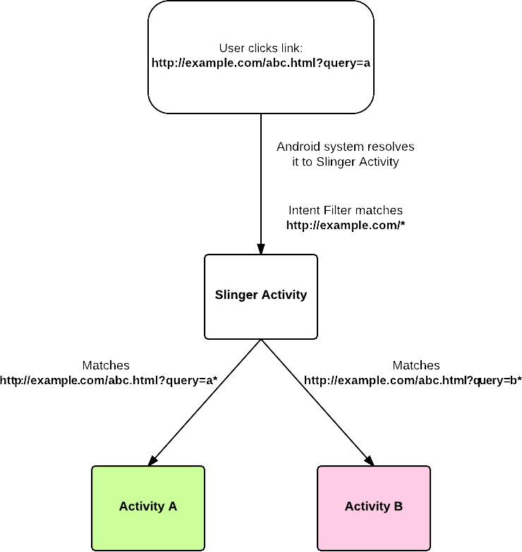

Slinger - deep linking library for Android
======

Slinger is a small Android library for handling custom Uri which uses regular expression to
catch and route URLs which won’t be handled by normal [intent-filter](http://developer.android.com/guide/topics/manifest/data-element.html#path) mechanism.

With slinger it’s possible to have deep links for quite complicated URLs.



## How do I use it?

Declare Activity in your manifest that will handle links within particular domain.

```xml
<activity
    android:name=".MySlingerRoutingActivity"
    android:noHistory="true">
    <intent-filter android:label="@string/app_name">
		<data android:host="example.com"
		      android:pathPattern=".*"
              android:scheme="http" />
    </intent-filter>
</activity>
```

In `MySlingerRoutingActivity` provide custom `IntentResolver` that redirect URLs
to concrete Activities based on regular expressions.

```java
public class MySlingerRoutingActivity extends SlingerActivity {

  ...
  
  private RedirectRule getRedirectRuleForAboutActivity() {
    return RedirectRule.builder()
                       .intent(new Intent(context, MyConcreteActivityA.class))
                       .pattern("http://example.com/abc\\\\.html\\\\?query=a.*")
                       .build();
  }
  
  @Override protected IntentResolver getIntentResolver() {
    return new IntentResolver(asList(getRedirectRuleForAboutActivity()));
  }
}
```

In case when no redirect rule is matched Slinger will fallback to default URL handler (usually browser).

## Customizing

### Matching Activities

`IntentResolver` can be extended and `resolveIntentToSling` method can be overridden to match URLs using
other mechanism than regular expression matching.

### Enriching Slinged Intents with Referrer and input URL

Slinger enriches Intents with URL and [referrer](http://developer.android.com/reference/android/app/Activity.html#getReferrer()) by default.
This can be changed by overriding `enrichIntent` method in `SlingerActivity`

### Fallback mechanism when no rule is matched

To provide different way of starting Activities just override `excludeSlingerAndStartTargetActivity` method in `SlingerActivity`

## Security considerations

Slinger does not sanitize input in any way. So providing security for application is your responsibility.

## License

**slinger** is published under [Apache License 2.0](http://www.apache.org/licenses/LICENSE-2.0).